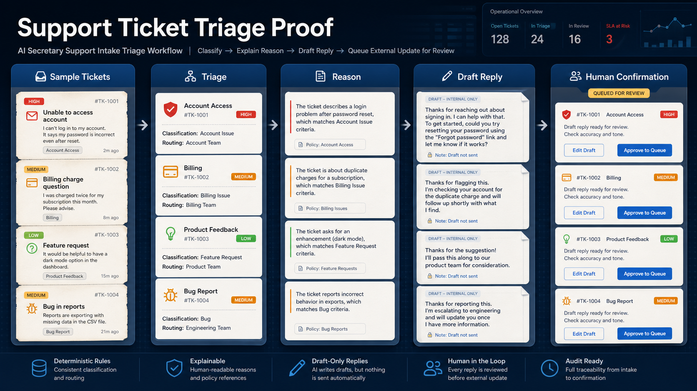

# Support Ticket Triage Proof

A public-safe proof slice for an AI secretary that triages support-ticket-like inputs without updating any external ticket system.



## One-minute summary

This repository demonstrates a practical AI-secretary pattern:

```text
sample support tickets -> triage -> draft-only reply -> human confirmation queue
```

It is meant as a reusable proof for:

- support intake triage
- human-in-the-loop automation
- safe action boundaries before external side effects
- deterministic Python implementation with synthetic fixtures and tests

## For reviewers

Review these first:

1. `outputs/triage_report.md` — generated sample report
2. `src/triage_engine.py` — classification logic without external side effects
3. `tests/` — safety and behavior checks
4. `docs/privacy-boundary.md` — what must not be published
5. `docs/showcase-copy.md` — how to describe this proof in public demo contexts

## What this proves

This proof shows that an AI secretary can help with support intake without directly changing a ticket system. It can first:

- classify tickets into urgent, needs-reply, backlog, blocked, and no-action groups
- explain the triage reason
- create draft-only replies where useful
- place external updates into a confirmation queue
- keep the default demo sample-first, deterministic, and public-safe

## Scope boundaries

This is not:

- a production helpdesk
- a live ticket-system integration
- an autonomous ticket updater
- a hosted SaaS demo

It is a focused proof of the support triage and confirmation pattern.

## Quick demo

From this proof directory:

```powershell
python -X utf8 run_demo.py
```

Run tests:

```powershell
python -m pytest tests -q
python scripts/check_public_boundary.py
```

## Safety model

The default mode is:

- no external APIs
- no ticket updates
- no comment posting
- no label changes
- no email or notification sending
- no automatic action execution

Action-worthy recommendations are represented as confirmation queue entries for human review.

## Public/private boundary

This repository uses synthetic fixtures only. It should not contain real ticket text, customer details, private support logs, local absolute paths, tokens, secrets, credentials, or private knowledge-base outputs.

See:

- `docs/privacy-boundary.md`
- `docs/public-export-checklist.md`
- `docs/showcase-copy.md`
